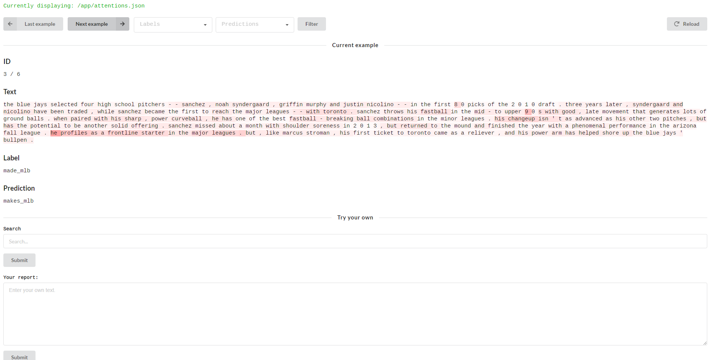

# Trouble with the Curve

This web app accompanies my upcoming paper, _Trouble with the Curve: Predicting Future Major-Leaguers from Scouting Reports_. The data used to train this model will accompany that paper.

The data was acquired from [MLB.com](http://m.mlb.com/prospects/2019)'s top prospect rankings. Fasttext was used to pre-train word embeddings on the very domain-specific corpus of scouting reports, and then a [Hierchical Attention Network](https://www.cs.cmu.edu/~hovy/papers/16HLT-hierarchical-attention-networks.pdf) was trained to classify each report using [JoungheeKim's](https://github.com/JoungheeKim/Pytorch-Hierarchical-Attention-Network) PyTorch implementation. The attention weights for each classification was then visualized using [yuhaozhang's](https://github.com/yuhaozhang/text-attn-vis) excellent visualization tool.
