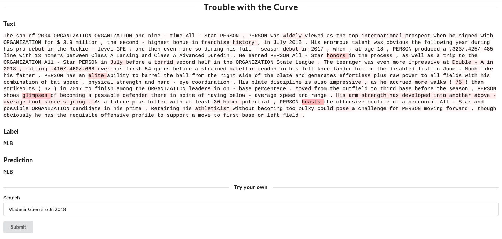

# Trouble with the Curve

This repository contains the data, models, and web app for my paper _Trouble with the Curve: Predicting Future MLB Players Using Scouting Reports_.

## [Data](https://github.com/jacobdanovitch/Trouble-With-The-Curve/tree/master/data)

To the best of my knowledge, this is the only existing dataset of its kind for baseball prospect profiles. Almost 10,000 profiles were acquired from [MLB.com](http://m.mlb.com/prospects/2019) and [FanGraphs](https://fangraphs.com) containing players' scouting reports and 20-80 scale grades, as well as select metadata.

## [Models](https://github.com/jacobdanovitch/Trouble-With-The-Curve/tree/master/notebooks)

With the above data, an obvious question arises: Can we predict if a player will make the major leagues? We use a variety of deep learning methods to attempt to answer this question, and achieve a strong "maybe". We also present an analysis of the language variations within the reports between successful players, as well as between positions.

| Model             | Accuracy | F1     |
|-------------------|----------|--------|
| Bag-Of-Embeddings | 64.65%   | 53.78% |
| TextCNN           | 69.02%   | 56.42% |
| LSTM+SelfAttn     | 68.64%   | 54.65% |
| BCN               | 73.52%   | 43.33% |
| HAN               | 66.00%   | 54.07% |

## [Web App](https://github.com/jacobdanovitch/Trouble-With-The-Curve/tree/master/webapp)

A Hierarchical Attention Network is trained as part of the above question, allowing not only a demonstration of the research problem, but also an interpretable visualization for each prediction using attention weights.
